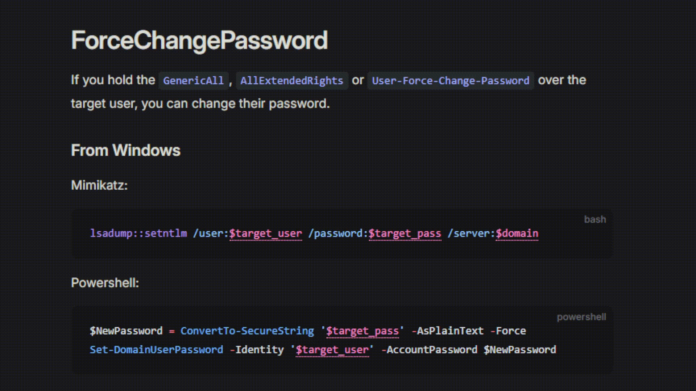

# VitePress Markdown Variables

## Demo


Checkout the [demo](./demo) directory for a working example.

## Installation
1. `npm install --save-dev vitepress-md-var` 
2. Create `.vitepress/theme/index.ts`
3. Paste the following code  
```typescript
import DefaultTheme from 'vitepress/theme';
import { useRoute } from 'vitepress';
import mdVar from 'vitepress-md-var';

export default {
    ...DefaultTheme,
    enhanceApp(ctx) {
        DefaultTheme.enhanceApp(ctx);
    },
    setup() {
        const route = useRoute();
        mdVar(route);
    }
};
```


## Configuration

Configuration can be passed as the second argument to the `mdVar` constructor. It should implement the interface shown below:

```typescript
export interface MarkdownVariablesConfig {
    // Strings that start with this prefix are treated as variables
    prefix?: string,
    // Strings that start with this prefix are NOT treated as variables
    noVarPrefix?: string,
    // This function will be called to store a variable's value in persistent storage
    storeVar?: ((varName: string, varValue: string) => void),
    // This function will be called to load a variable's value from persistent storage
    loadVar?: ((varName: string) => string|null)
}
```

### Variable persistence

Implement the `storeVar` and `loadVar` functions to persist variables across pages.

```typescript
export default {
  ...DefaultTheme,
  enhanceApp(ctx) {
    DefaultTheme.enhanceApp(ctx);
  },
  setup() {
    const route = useRoute();
    mdVar(route, {
      loadVar: (varName) => localStorage.getItem("MD_" + varName),
      storeVar: (varName, varVal) =>
        localStorage.setItem("MD_" + varName, varVal),
    });
  },
};
```

### Styling

An alternative style is the "The Hacker Recipes" (THR) style, shown below:


You can specify it using the `styling` parameter:
```typescript
mdVar(route, {
  styling: "thr"
});
```

If you would like to use your own CSS instead, simply set `styling` to your CSS string.

The default and THR themes are defined in [`config.ts`](./lib/config.ts)